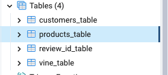
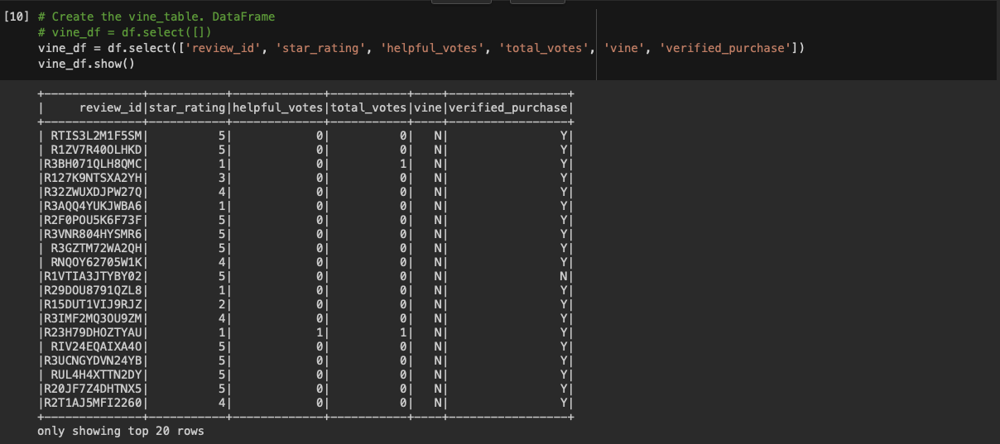
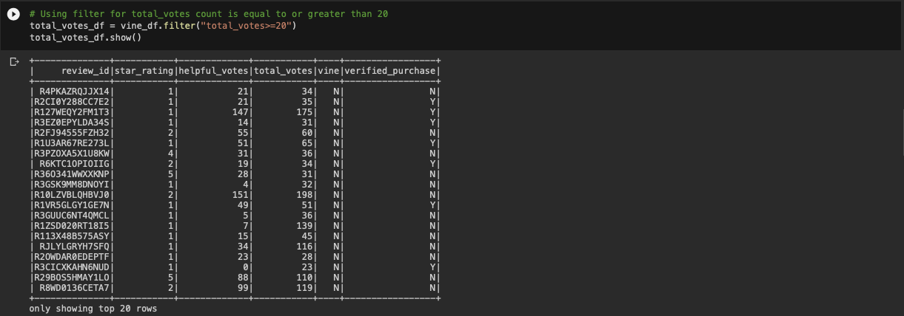
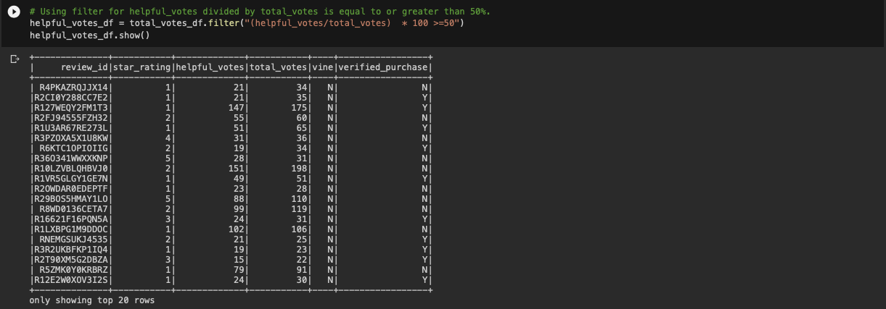

# Amazon Vine Analysis

## Project Overview

Analyzing the Amazon customer review dataset is the goal of this project. The dataset is extracted, the data is transformed, and a connection to an [AWS RDS](https://aws.amazon.com/rds/) instance is made using [PySpark](https://spark.apache.org/docs/latest/api/python/). After transformation, the data is put into pgAdmin. The dataset is examined with Pandas to see whether there is any bias favouring positive ratings from "[Amazon Vine](https://www.amazon.com/gp/vine/help)" users.

## Resources 
### Data Source
The dataset is extracted from [Amazon's US Reviews Dataset](https://s3.amazonaws.com/amazon-reviews-pds/tsv/index.txt). From this list, the Video Game dataset is chosen for analysis. [Click here to download the full Video Game dataset](https://s3.amazonaws.com/amazon-reviews-pds/tsv/amazon_reviews_us_Video_Games_v1_00.tsv).

### Softwares:

## What is Amazon Vine?
Through the Amazon Vine programme, a curated group of Amazon consumers known as "Vine Voices" can provide reviews for manufacturers and publishers' items. These Vine Voices were selected based on a number of factors, including the quantity and quality of their reviews. **These Vine Voices are compelled to write reviews in return for free goods.** Voices are not compensated, according to [Amazon's Vine help manual](https://www.amazon.com/gp/vine/help), and the company appreciates "honest opinions regarding the product."

## Extract, Transform, Load (ETL)  
Using [Amazon_Reviews_ETL.ipynb](/Amazon_Reviews_ETL.ipynb), [Customers_df](Resources/customers_table), [Products_df](Resources/products_table), [Review_id_df](Resources/review_id_table), and [Vine_df](Resources/vine_table) are the DataFrames that were created from the video game dataset. Each of these DataFrames is written to an existing table in pgAdmin after connecting to the AWS RDS instance. For security reasons, the password and url used to setup the RDS settings have been concealed; you must enter your own information in this section.

For the purpose of this project, only the vine_table is necessary, which is exported using PySpark as [vine_table](Resources/vine_table).

### Determining Review Bias

To determine if there is any review bias, PySpark is used to filter and create new DataFrames. This potion of the analysis is found in [Vine_Review_Analysis.ipynb](/Vine_Review_Analysis.ipynb).

The [vine_table](Resources/vine_table) is read in as DataFrame:

In the [first filter](Resources/more_20.png), vine_df is filtered to only show rows where the number of total votes is greater than or equal to 20. Doing this will help pick reviews that more likely to be helpful and to avoid having division by zero errors. This filter is saved as a new DataFrame.

A [second filter](Resources/greater_50.png) (Filter #2) is then used on previous filter (Filter #1) to create a new DataFrame that retrieves all rows where the number of helpful votes divided by the total votes is greater than or equal to 50%.

Finally, two more DataFrames are created to separate Filter #2 between reviews written as [part of the Vine program (paid)](resources/vine_paid_df.png) and reviews [not part of the Vine program (unapid)](resources/nonvine_unpaid_df.png). After creating these final DataFrames, the following metrics are determined:
- The total number of reviews.
- The number of 5-star reviews.
- The percentage of 5-star reviews (Paid and Unpaid).

## Results
For the Video Game dataset:
- There are only 94 Vine reviews.
  - 48 of Vine reviews gave 5-stars.
  - Approximately **51.06% of Vine reviews were 5-stars.**
- There are 40,471 non-Vine reviews.
  - 15,663 non-Vine reviews gave 5-stars.
  - Approximately **38.70% of non-Vine reviews were 5-stars.**

## Summary
Based on this analysis, **there appears to be a positivity bias among Video Game reviews in the Vine program**. While only 38.70% of regular reviews gave 5-stars, 51.06% of Vine reviews gave 5-stars. 

It should be emphasised, nonetheless, that this dataset does not represent any particular product. This dataset includes a wide range of various hardware, software, and add-ons for various video game consoles. Due to the wide range of items, this analysis must be performed on the dataset as a whole rather than on specific products. Additionally, just 0.23% of the 40,565 data points examined were Vine reviews. This number of reviews is insufficient to have an impact on the overall evaluation of the products available for purchase on Amazon.

### Recommendations for Further Analysis
Comparing the typical Vine review ratings to typical customer ratings is another analysis that might be done on this dataset to investigate the potential for positivity bias. If it turns out that Vine customers have higher star ratings on average than customers who don't use Vine, this may be evidence of positivity bias.
